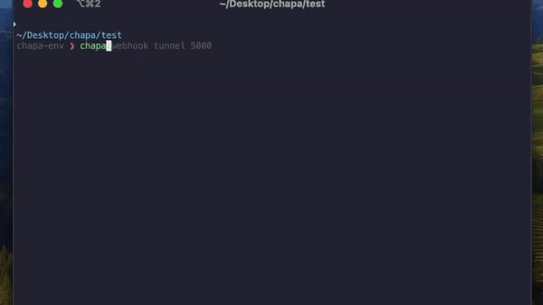

# Chapa CLI

**Chapa CLI** is a command-line tool that helps you integrate, manage, and interact with Chapa's payment API directly from your terminal. This tool provides various commands to handle transactions, retrieve bank details, and more, making it easier to work with Chapa's API without the need for manual API calls.

## Chapa CLI in Action




## Features

- **Initialize Transactions:** Create new transactions directly from the CLI.
- **Verify Transactions:** Check the status of a transaction.
- **Get Banks:** Retrieve a list of supported banks.
- **Get Transaction Events:** Fetch and display events related to a specific transaction.
- **Webhook Management:** Listen to and test webhooks.

## Installation

You don't need this source code unless you want to modify the package. If you just want to use the package, just run:

```bash
pip install --upgrade chapa-cli
```


Install from source with:

### Prerequisites

- Python 3.7 or later (PyPy supported)
- pip (Python package installer)

### Steps


### 

1. **Clone the Repository:**
   ```bash
   git clone https://github.com/chapa-Et/chapa-cli.git
   cd chapa-cli
   ```

2. **Create and Activate a Virtual Environment:**
   ```bash
   python -m venv chapa-env
   source chapa-env/bin/activate  # On Windows use: chapa-env\Scripts\activate
   ```

3. **Install the CLI:**
   ```bash
   pip install -e .
   ```

## Usage

### Login

Before using most commands, you need to log in by providing your Chapa API token.

```bash
chapa login
```

You will be prompted to enter your Chapa secret token. This token is securely stored and used for authenticating API requests.

### Initialize a Transaction

```bash
chapa transaction initialize --amount 100 --phone 0911112233 --tx_ref REF123 --callback_url https://souq.com/callback
```

### Verify a Transaction

```bash
chapa transaction verify --reference REF123
```

### Get Supported Banks

```bash
chapa transaction banks
```

### Get Transaction Events

```bash
chapa transaction events AP9ARo9XvMO5
```

### Webhook Management

#### Listen to a Webhook

```bash
chapa webhook listen /pay/chapa-webhook
```

#### Ping a Webhook

```bash
chapa webhook ping http://localhost:5000/pay/chapa-webhook
```

## Configuration

### Storing the Token

Your Chapa secret token is stored in a configuration file located at `~/.chapa-cli_config.json`. This file is created when you log in using the `chapa login` command.

### Environment Variables

If needed, you can also set environment variables for the CLI:

- `CHAPA_API_TOKEN`: Set this to your Chapa API token if you want to bypass the login prompt.

## Development

### Running Tests

To run tests, you can use `pytest` or any other testing framework of your choice:

```bash
pytest
```

### Contributing

Contributions are welcome! Please fork the repository, make your changes, and submit a pull request.

1. Fork the repository.
2. Create your feature branch: `git checkout -b feature/your-feature-name`.
3. Commit your changes: `git commit -am 'Add some feature'`.
4. Push to the branch: `git push origin feature/your-feature-name`.
5. Open a pull request.

## License

This project is licensed under the MIT License. Check the [LICENSE](./LICENSE) file for details.
